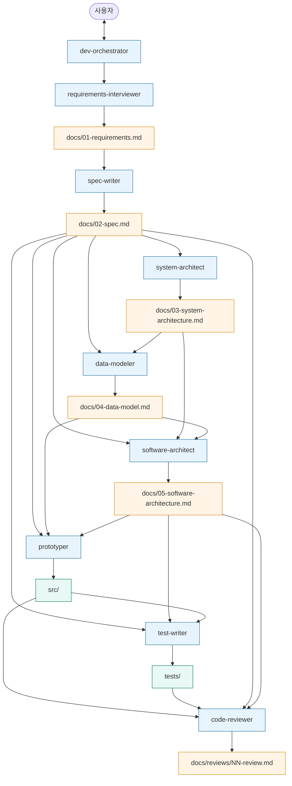
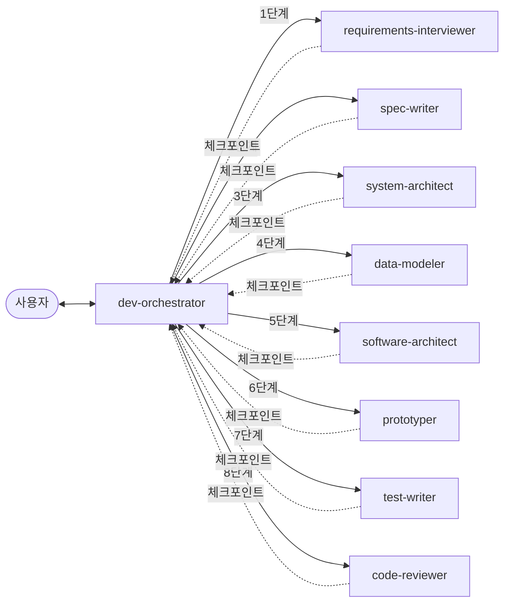

# my-claude-os
## 1. 내 업무의 중심 워크플로우는 무엇인가?
### - 요청자(기획자,비즈니스담당자)과의 소통을 통해 시스템으로 구현해야할 구체적인 요구사항을 정리하는 것
### - 요구사항을 기반으로 제공에 필요한 자원들 도출(내/외부 시스템, DB 등)
### - 도출된 자원의 Owner 와 실제 필요한 연동이 가능한지 협의. 불가할 경우 다른 대안 수립
### - 결정된 자원들을 기반으로 어플리케이션 및 데이터모델 등 설계
### - 설계내용을 협업 가능한 Task 단위로 분리
### - Task 대로 개발 및 테스트 진행
### - 통합테스트, 인수테스트 진행
### - 배포 절차에 따라 프로덕션에 배포
### - 배포 점검 및 모니터링

## 2. 나만의 OS에 꼭 포함되어야 하는 핵심 철학/관점은 무엇인가?
### - 요구사항을 구현하면서도 기존 코드에 사이드이펙트가 발생하지 않는 것을 보장하는 것. 이를 위한 테스트코드
### - DDD, 객체지향, 팀의 컨벤션에 따른 클린코드 유지

## 3. 내 OS가 일을 잘 하려면 어떤 정보(컨텍스트)가 필요한가?
### - 비즈니스 도메인에 대한 체계적인 지식 및 무결성 유지

## 오케스트레이터
### 
1. 전체 개발 오케스트레이터
   - 역할 : 전체 워크플로우를 관할하며 에이전트의 협업을 주도한다. 사용자와의 인터페이스를 주도하며, 요청해따라 품질을 높힐 수 있도록 플로우를 반복한다.
2. 요구사항 인터뷰 및 정의
   - 역할 : 사용자에게 개발에 필요한 구페적인 요구사항들을 인터뷰를 통해 도출하고, 최종 요구사항 문서를 작성한다.
3. 개발 명세서(Spec) 정의
   - 역할 : 정의된 요구사항 문서를 바탕으로 개발 명세서를 작성한다.
4. 시스템 아키텍처 셜계
   - 역할 : 개발 명세서를 바탕으로 시스템 아키텍처 설계서를 도식화하여 작성한다.
5. 데이터모델 설계
   - 역할 : 개발 명세서 및 시스테 아키텍처를 기반으로 데이터모델링 후 ERD를 작성한다.
6. 소프트웨어 아키텍쳐 설계
   - 역할 : 개발 명세서 및 시스템 아키텍처, 데이터모델을 기반으로 응용 소프트웨어의 구조를 설계하고 설계서를 작성한다.
7. 프로토타입 개발
   - 역할 : 위에서 나온 산출물을 기반으로 가장 기본적인 동작을 하는 프로토타입 어플리케이션을 개발한다.

## 최종 에이전트 구성 (9개)

| # | 에이전트 | 역할 | 산출물 |
|---|---------|------|--------|
| 0 | `dev-orchestrator` | 전체 워크플로우 관할, 사용자 인터페이스 | (조정만) |
| 1 | `requirements-interviewer` | 요구사항 인터뷰 및 정의 | `docs/01-requirements.md` |
| 2 | `spec-writer` | 개발 명세서 작성 | `docs/02-spec.md` |
| 3 | `system-architect` | 시스템 아키텍처 설계 | `docs/03-system-architecture.md` |
| 4 | `data-modeler` | 데이터 모델 설계 + ERD | `docs/04-data-model.md` |
| 5 | `software-architect` | 소프트웨어 아키텍처 + API 명세 | `docs/05-software-architecture.md` |
| 6 | `prototyper` | 프로토타입 개발 (수직 슬라이스 1개) | `src/`, `docs/06-prototype-notes.md` |
| 7 | `test-writer` | 테스트 작성 (단위/통합/E2E) | `tests/` |
| 8 | `code-reviewer` | 코드 리뷰 | `docs/reviews/NN-review.md` |

## 워크플로우 (산출물 흐름)

## 오케스트레이터 호출 관계

- 실선 화살표: 오케스트레이터가 단계별로 서브 에이전트를 호출
- 점선 화살표: 산출물 완성 후 사용자 OK 받기 위해 오케스트레이터로 복귀
- 수정 요청 시 같은 에이전트 재호출 (최대 3회)
